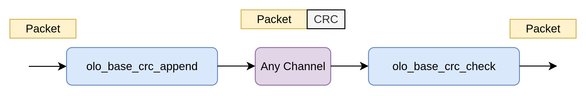
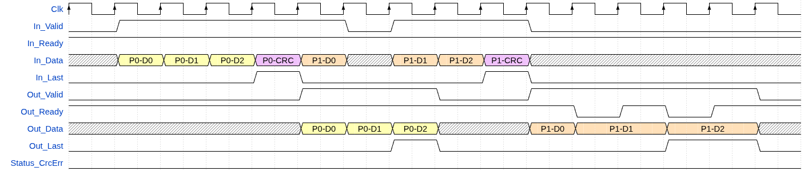
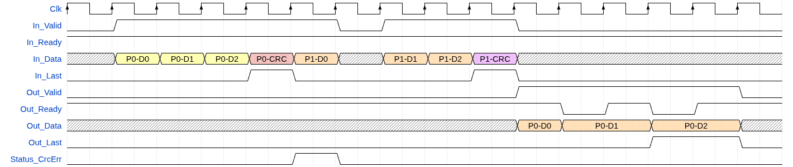
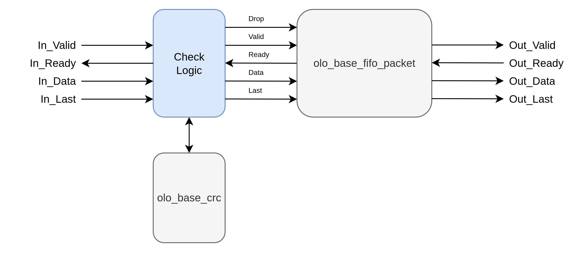

# olo_base_crc_check

[Back to **Entity List**](../EntityList.md)

## Status Information

VHDL Source: [olo_base_crc_check](../../src/base/vhdl/olo_base_crc_check.vhd)

## Description

This component does check the CRC contained in AXI4-Stream packets as last word. It is meant to be used together with
_olo_base_crc_append_ to CRC protect any data stream.

The CRC to appended to the packet must be smaller or equal to the width of the data stream (_DataWidth_g_).

CRC settings are identical to [olo_base_crc](./olo_base_crc.md), plese refer to the documentation of _olo_base_crc_
for details. The CRC is calculated over all data words except the last one which contains the CRC itself.

Below waveform shows an example use-case.

Note that the exact latency might be different. The important point in the figure are:

- There is one bubble cycle per packet in the output stream (when CRC is checked)
- There are no bubble cycles in the input stream
- Input and output support full AXI4-Stream handshaking (Ready/Valid)
- The packet is only presented to the output after it wass fully received and the CRC check was successful

Failed CRC checks (red CRC in below figure) lead to the whole packet being dropped and _Status_CrcErr_ being
pulsed high.

## Generics

| Name               | Type             | Default     | Description                                                  |
| :----------------- | :--------------- | ----------- | :----------------------------------------------------------- |
| DataWidth_g        | positive         | -           | Data width of the data stream                                |
| FifoDepth_g        | positive         | -           | Depth of the internal packet FIFO (in number of data words). Must be at least _2 x maximum packet size_ for optimal performance.         |
| CrcPolynomial_g    | std_logic_vector | -           | See [olo_base_crc](./olo_base_crc.md)                        |
| CrcInitialValue_g  | std_logic_vector | all '0'     | See [olo_base_crc](./olo_base_crc.md)                        |
| CrcBitOrder_g      | string           | "MSB_FIRST" | See [olo_base_crc](./olo_base_crc.md)                        |
| CrcByteOrder_g     | string           | "NONE"      | See [olo_base_crc](./olo_base_crc.md)                        |
| CrcBitflipOutput_g | boolean          | false       | See [olo_base_crc](./olo_base_crc.md)                        |
| CrcXorOutput_g     | std_logic_vector | all '0'     | See [olo_base_crc](./olo_base_crc.md)                        |

**Note:** For cases where no exact CRC specification must be followed (for user defined protocols) it is suggested
to leave the following generics on their default value. These generics are only used to match exact CRC
specifications

- CrcXorOutput_g
- CrcBitflipOutput_g
- CrcByteOrder_g
- CrcBitOrder_g
- CrcInitialValue_g

## Interfaces

### Control

| Name | In/Out | Length | Default | Description                                     |
| :--- | :----- | :----- | ------- | :---------------------------------------------- |
| Clk  | in     | 1      | -       | Clock                                           |
| Rst  | in     | 1      | -       | Reset input (high-active, synchronous to _Clk_) |

### Input Data

| Name     | In/Out | Length        | Default | Description                                                  |
| :------- | :----- | :------------ | ------- | :----------------------------------------------------------- |
| In_Data  | in     | _DataWidth_g_ | -       | Input data                                                   |
| In_Valid | in     | 1             | '1'     | AXI4-Stream handshaking signal for _In_Data_                 |
| In_Ready | out    | 1             | -       | AXI4-Stream handshaking signal for _In_Data_                 |
| In_Last  | in     | 1             | '0'     | AXI4-Stream packet end signaling for _In_Data_               |

### Output Data

| Name      | In/Out | Length                | Default | Description                                     |
| :-------- | :----- | :-------------------- | ------- | :---------------------------------------------- |
| Out_Data  | out    | _DataWidth_g_         | -       | Output data                                     |
| Out_Valid | out    | 1                     | -       | AXI4-Stream handshaking signal for _Out_Data_   |
| Out_Ready | in     | 1                     | '1'     | AXI4-Stream handshaking signal for _Out_Data_   |
| Out_Last  | out    | 1                     | -       | AXI4-Stream packet end signaling for _Out_Data_ |

### Status

| Name           | In/Out | Length | Default | Description                                     |
| :------------- | :----- | :----- | ------- | :---------------------------------------------- |
| Status_CrcErr  | out    | 1      | N/A     | Pulsed high when a packet with invalid CRC was detected and dropped. |

## Architecture

The architecture is relatively trivial thanks to the already existing _olo_base_crc_ and _olo_base_fifo_packet_
components.

The check logic simply asserts the _Drop_ signal to the packet FIFO when the CRC at the end of a packet does not
match the CRC calculated by _olo_base_crc_.
